# Microblog 业务事实手册

> 本文档由 business-facts-extractor 从源码提取生成，每条事实均携带 `file:lines` 出处。
> 机器可读版本见同目录 `facts.json`（101 条事实）。

## 1. 项目概述

Microblog 是一个 Flask 编写的多用户微博客系统：用户注册登录后发布最长 140 字的博文，可以关注其他用户形成个人信息流，互发私信，并通过全文搜索查找博文；系统同时暴露一套基于令牌认证的 REST API 供第三方客户端操作用户资源。它服务于普通社交用户与 API 客户端两类角色，最核心的用户任务是**登录后在首页发布博文并浏览关注者的动态流**。

## 2. 角色与用户任务

### 角色 × 任务矩阵

| 任务 | 访客 | 登录用户 | API 客户端 |
|---|---|---|---|
| 注册账号 | ✅ | — | ✅（F-0085） |
| 登录 / 退出 | ✅ | ✅ | — |
| 找回 / 重置密码 | ✅ | — | — |
| 发布博文 / 浏览信息流 | — | ✅ | — |
| 搜索博文 | — | ✅ | — |
| 翻译博文 | — | ✅ | — |
| 导出博文 | — | ✅ | — |
| 查看主页 / 编辑资料 / 关注取关 | — | ✅ | ✅（F-0086/F-0088） |
| 收发私信 / 查看通知 | — | ✅ | — |
| 换取 / 吊销令牌 | — | — | ✅（F-0083/F-0084） |

### 2.1 登录（F-0012）

1. 用户在登录页输入用户名和密码，可勾选「记住我」（`app/auth/forms.py:10-14`，`app/templates/auth/login.html:1-11`）。
2. 后端校验：用户名不存在或密码错误都给出统一的「用户名或密码无效」提示（`app/auth/routes.py:20-25`）。
3. 登录成功后跳转到登录前想访问的页面；若跳转目标带外部域名则被忽略、改跳首页（`app/auth/routes.py:27-30`）。

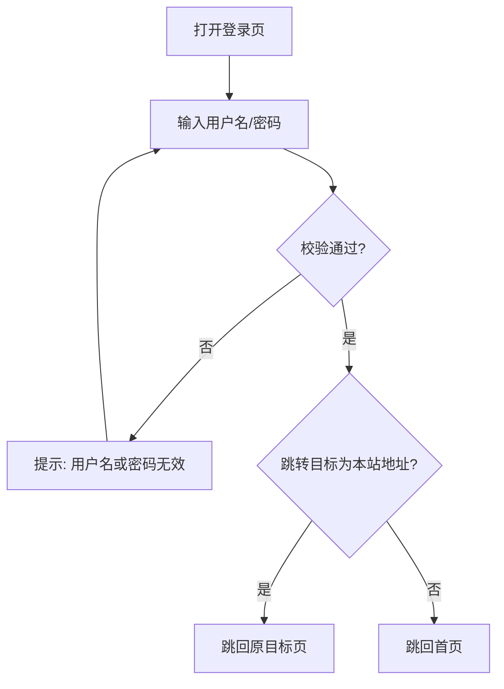
```mermaid
flowchart TD
  A[打开登录页] --> B[输入用户名/密码]
  B --> C{校验通过?}
  C -- 否 --> D[提示: 用户名或密码无效] --> B
  C -- 是 --> E{跳转目标为本站地址?}
  E -- 是 --> F[跳回原目标页]
  E -- 否 --> G[跳回首页]
```

### 2.2 注册（F-0013）

1. 访客在注册页填写用户名、邮箱和两遍密码（`app/auth/forms.py:17-24`，`app/templates/auth/register.html:1-7`）。
2. 表单校验：全部必填、邮箱格式合法、两次密码一致；用户名和邮箱全站唯一（`app/auth/forms.py:26-35`）。
3. 注册成功后无需验证邮箱，直接被引导回登录页登录（`app/auth/routes.py:44-50`）。

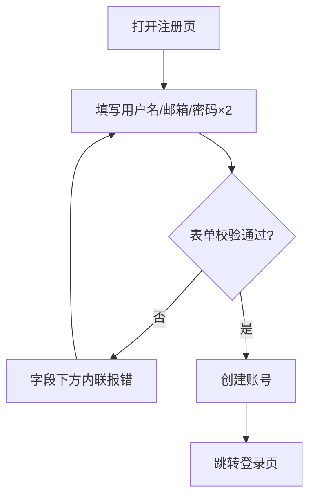
```mermaid
flowchart TD
  A[打开注册页] --> B[填写用户名/邮箱/密码×2]
  B --> C{表单校验通过?}
  C -- 否 --> D[字段下方内联报错] --> B
  C -- 是 --> E[创建账号] --> F[跳转登录页]
```

### 2.3 找回并重置密码（F-0014）

1. 用户提交注册邮箱；无论邮箱是否注册，页面都显示相同的「请查收邮件」提示（`app/auth/routes.py:59-66`）。
2. 系统后台线程异步发送含 JWT 重置链接的邮件，链接 10 分钟内有效（`app/auth/email.py:6-14`，`app/models.py:180-183`）。
3. 用户点击链接设置新密码；链接无效或过期时被静默重定向到首页（`app/auth/routes.py:76-78`）。

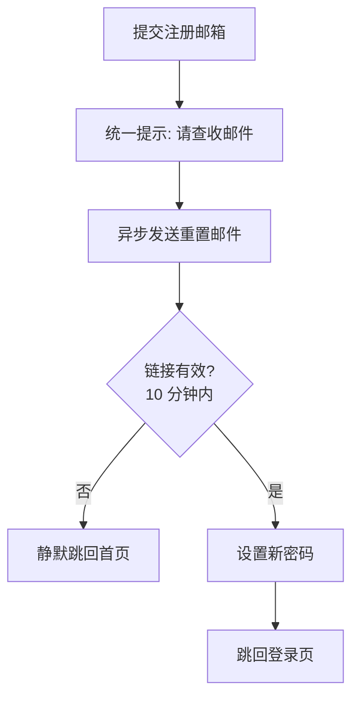
```mermaid
flowchart TD
  A[提交注册邮箱] --> B[统一提示: 请查收邮件]
  B --> C[异步发送重置邮件]
  C --> D{链接有效?<br/>10 分钟内}
  D -- 否 --> E[静默跳回首页]
  D -- 是 --> F[设置新密码] --> G[跳回登录页]
```

### 2.4 退出登录（F-0015）

已登录用户访问退出链接即被登出并跳转回首页（`app/auth/routes.py:33-36`）。

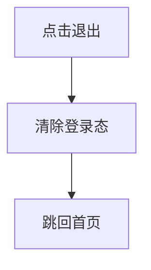
```mermaid
flowchart TD
  A[点击退出] --> B[清除登录态] --> C[跳回首页]
```

### 2.5 发布博文并浏览信息流（F-0029）

1. 登录用户在首页输入博文并提交；内容必填，1–140 字（`app/main/forms.py:31-34`）。
2. 系统自动检测正文语言并随博文保存，检测失败则语言留空（`app/main/routes.py:29-35`）。
3. 首页信息流只含自己关注的人（含自己）的博文；探索页展示全站博文，均按时间倒序、每页 25 条分页（`app/main/routes.py:41-51`，`app/main/routes.py:54-68`，`config.py:25`）。

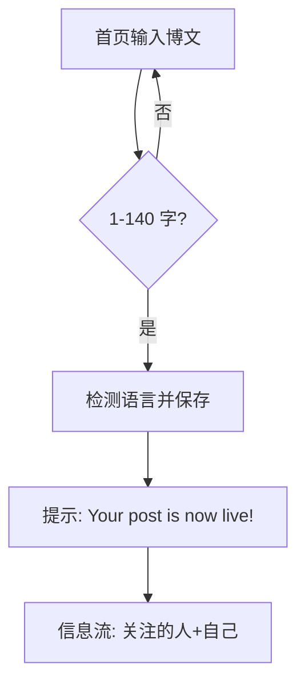
```mermaid
flowchart TD
  A[首页输入博文] --> B{1-140 字?}
  B -- 否 --> A
  B -- 是 --> C[检测语言并保存]
  C --> D[提示: Your post is now live!]
  D --> E[信息流: 关注的人+自己]
```

### 2.6 搜索博文（F-0035）

1. 用户在顶部导航栏输入关键词（表单读 URL 参数、不启用 CSRF 校验，`app/main/forms.py:37-44`，`app/templates/base.html:32-35`）。
2. 空关键词直接重定向到探索页（`app/main/routes.py:167-168`）。
3. 结果页分页展示匹配博文；Elasticsearch 未配置时静默返回空结果（`app/main/routes.py:172-175`，`app/search.py:4-5`，`app/templates/search.html:1-22`）。

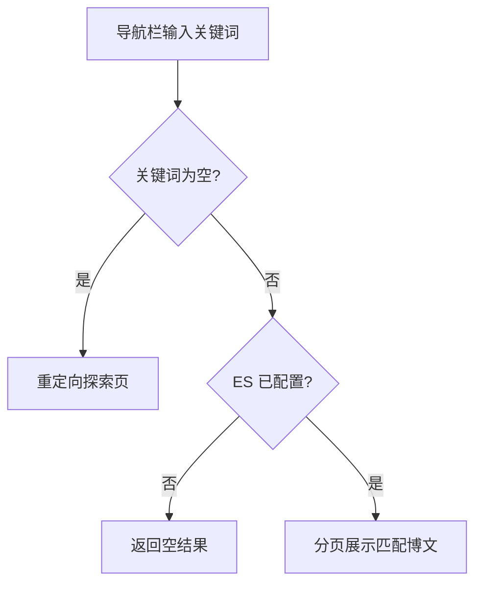
```mermaid
flowchart TD
  A[导航栏输入关键词] --> B{关键词为空?}
  B -- 是 --> C[重定向探索页]
  B -- 否 --> D{ES 已配置?}
  D -- 否 --> E[返回空结果]
  D -- 是 --> F[分页展示匹配博文]
```

### 2.7 翻译博文（F-0041）

1. 仅当博文带语言标记且与用户界面语言不同时才显示「翻译」链接（`app/templates/_post.html:18`）。
2. 前端异步调用翻译接口，译文直接替换显示在原博文下方（`app/main/routes.py:156-162`）。
3. 翻译服务未配置或调用失败时，用户看到的是提示文本而不是报错（`app/translate.py:6-8`，`app/translate.py:14-19`）。

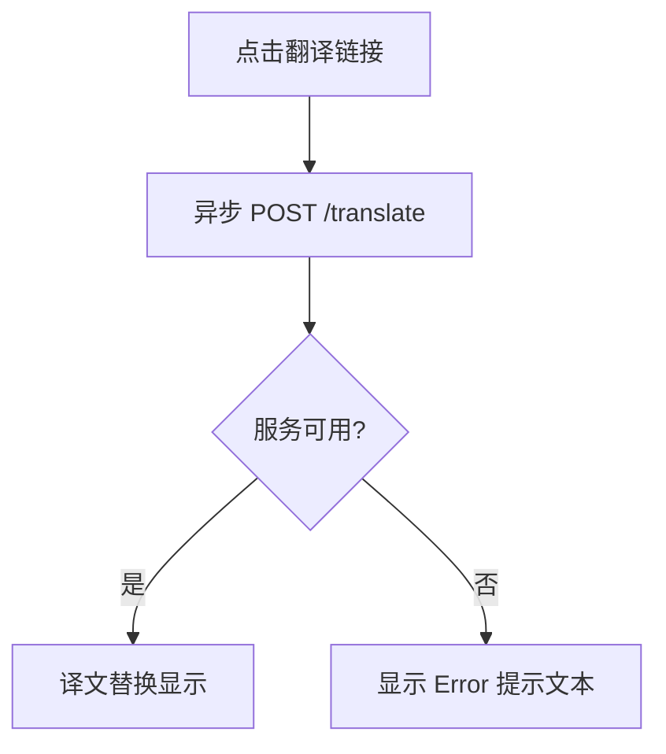
```mermaid
flowchart TD
  A[点击翻译链接] --> B[异步 POST /translate]
  B --> C{服务可用?}
  C -- 是 --> D[译文替换显示]
  C -- 否 --> E[显示 Error 提示文本]
```

### 2.8 导出博文（F-0046）

1. 用户在个人主页请求导出自己的全部博文（`app/main/routes.py:219-227`）。
2. 已有导出任务进行中时不重复启动，仅提示任务进行中（`app/main/routes.py:221-223`）。
3. 后台任务把博文按时间正序整理为仅含正文和时间戳的 JSON 附件，完成后邮件发送给用户（`app/tasks.py:27-47`，`app/templates/email/export_posts.html:1-4`）。

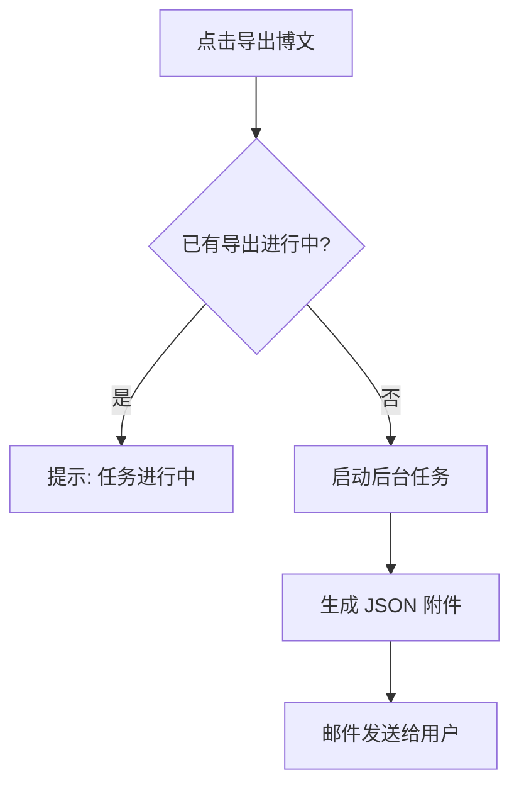
```mermaid
flowchart TD
  A[点击导出博文] --> B{已有导出进行中?}
  B -- 是 --> C[提示: 任务进行中]
  B -- 否 --> D[启动后台任务]
  D --> E[生成 JSON 附件] --> F[邮件发送给用户]
```

### 2.9 查看用户主页（F-0051）

1. 登录用户访问任意用户主页，查看其头像、用户名、简介、最近上线时间、关注/粉丝数和博文分页列表（`app/main/routes.py:71-87`，`app/templates/user.html:1-33`）。
2. 查看自己的主页时显示「编辑个人资料」链接而非关注按钮（`app/templates/user.html:14-33`）。
3. 访问不存在的用户返回 404（`app/main/routes.py:73`）。

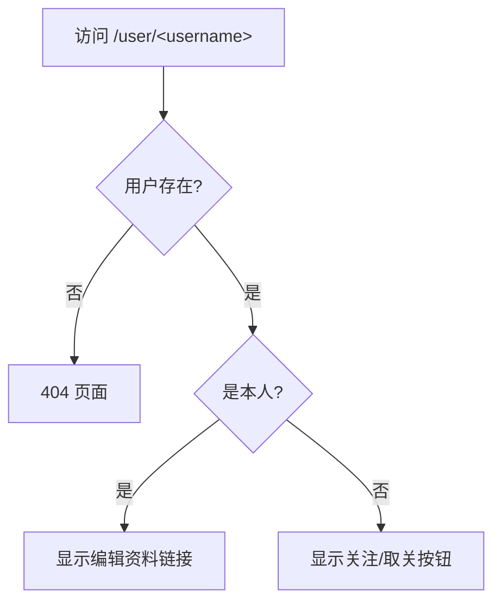
```mermaid
flowchart TD
  A[访问 /user/&lt;username&gt;] --> B{用户存在?}
  B -- 否 --> C[404 页面]
  B -- 是 --> D{是本人?}
  D -- 是 --> E[显示编辑资料链接]
  D -- 否 --> F[显示关注/取关按钮]
```

### 2.10 编辑个人资料（F-0052）

1. 用户进入编辑资料页，表单自动预填当前用户名和简介（`app/main/routes.py:97-112`，`app/templates/edit_profile.html:1-7`）。
2. 用户名必填且不得被他人占用；简介最长 140 字（`app/main/forms.py:12-27`）。
3. 保存成功后提示「您的更改已保存」并返回编辑页。

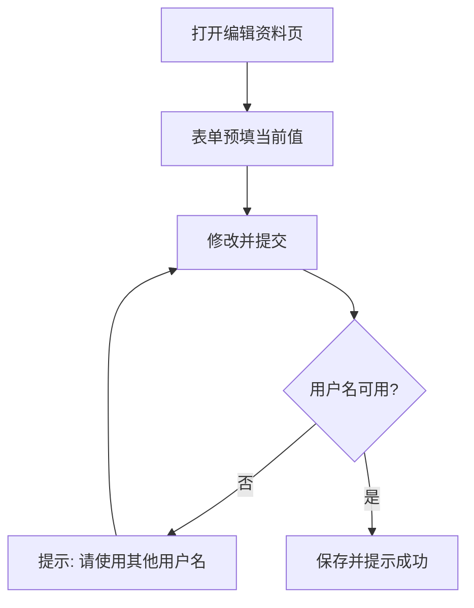
```mermaid
flowchart TD
  A[打开编辑资料页] --> B[表单预填当前值]
  B --> C[修改并提交]
  C --> D{用户名可用?}
  D -- 否 --> E[提示: 请使用其他用户名] --> C
  D -- 是 --> F[保存并提示成功]
```

### 2.11 查看资料浮层（F-0053）

用户将鼠标悬停在帖子作者用户名上时，弹出资料浮层显示该用户头像、简介、最近上线时间和关注/粉丝数（`app/main/routes.py:89-95`，`app/templates/user_popup.html:1-8`）。

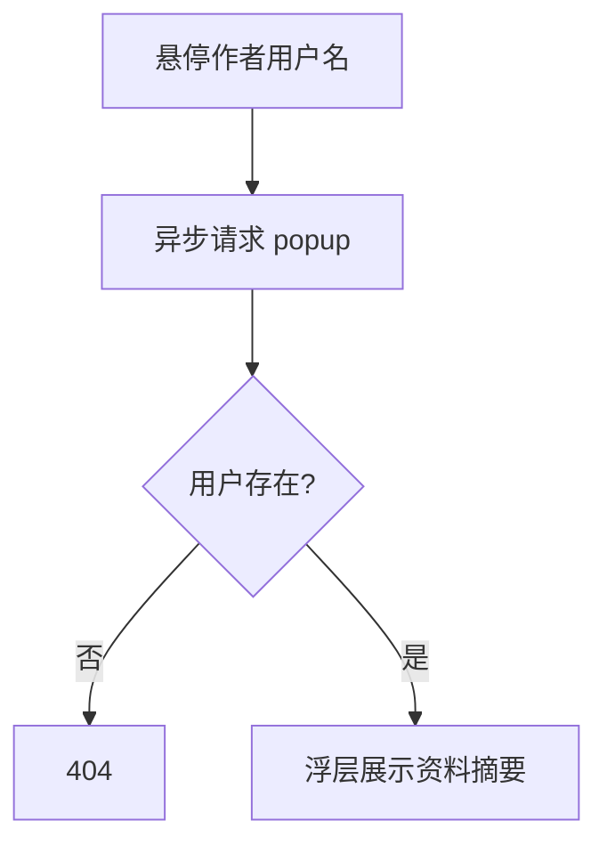
```mermaid
flowchart TD
  A[悬停作者用户名] --> B[异步请求 popup] --> C{用户存在?}
  C -- 否 --> D[404]
  C -- 是 --> E[浮层展示资料摘要]
```

### 2.12 关注 / 取消关注（F-0054）

1. 用户在他人主页或资料浮层点击「关注」按钮（仅接受 POST 提交，`app/main/forms.py:30-31`）。
2. 不能关注或取关自己，后端检测到会提示并跳回自己主页（`app/main/routes.py:123-125`，`app/main/routes.py:143-145`）。
3. 重复关注不会产生重复关系；目标用户不存在时提示「未找到该用户」并跳回首页（`app/models.py:142-149`，`app/main/routes.py:118-121`）。

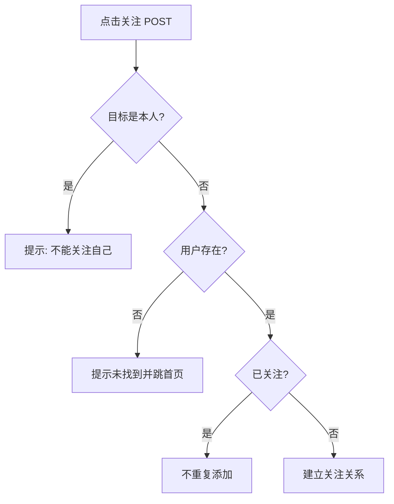
```mermaid
flowchart TD
  A[点击关注 POST] --> B{目标是本人?}
  B -- 是 --> C[提示: 不能关注自己]
  B -- 否 --> D{用户存在?}
  D -- 否 --> E[提示未找到并跳首页]
  D -- 是 --> F{已关注?}
  F -- 是 --> G[不重复添加]
  F -- 否 --> H[建立关注关系]
```

### 2.13 发送私信（F-0069）

1. 用户从他人主页进入发私信入口，填写内容并提交；内容必填、1–140 字（`app/main/forms.py:50-53`，`app/templates/send_message.html:1-7`）。
2. 发送成功后页面提示，系统重新计算收件人未读数并写入其通知（`app/main/routes.py:186-191`）。
3. 收件人不存在时返回 404；系统不拦截给自己发私信（`app/main/routes.py:183-193`）。

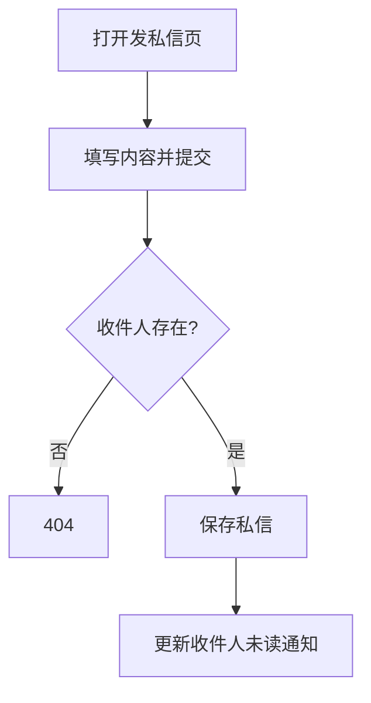
```mermaid
flowchart TD
  A[打开发私信页] --> B[填写内容并提交]
  B --> C{收件人存在?}
  C -- 否 --> D[404]
  C -- 是 --> E[保存私信]
  E --> F[更新收件人未读通知]
```

### 2.14 查看私信列表（F-0070）

1. 用户打开私信列表页，按发送时间倒序分页查看收到的私信（`app/main/routes.py:199-217`，`app/templates/messages.html:1-19`）。
2. 打开该页即把当前时间记为最后阅读时间，未读通知清零——无需逐条操作即全部视为已读（`app/main/routes.py:201-203`）。

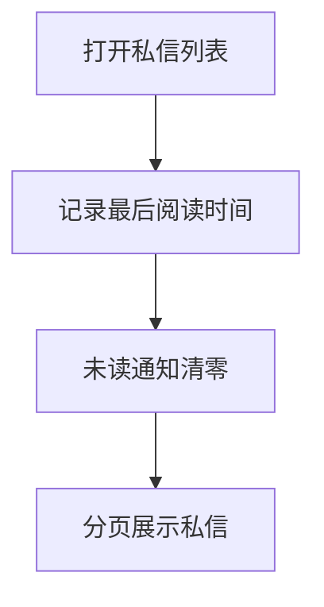
```mermaid
flowchart TD
  A[打开私信列表] --> B[记录最后阅读时间]
  B --> C[未读通知清零]
  C --> D[分页展示私信]
```

### 2.15 API：换取令牌（F-0083）

API 客户端用用户名和密码通过 HTTP Basic 认证换取访问令牌；令牌有效期 1 小时，剩余超过 60 秒时复用现有令牌（`app/api/tokens.py:6-11`，`app/models.py:260-268`）。用户名不存在或密码错误返回 401（`app/api/auth.py:12-21`）。

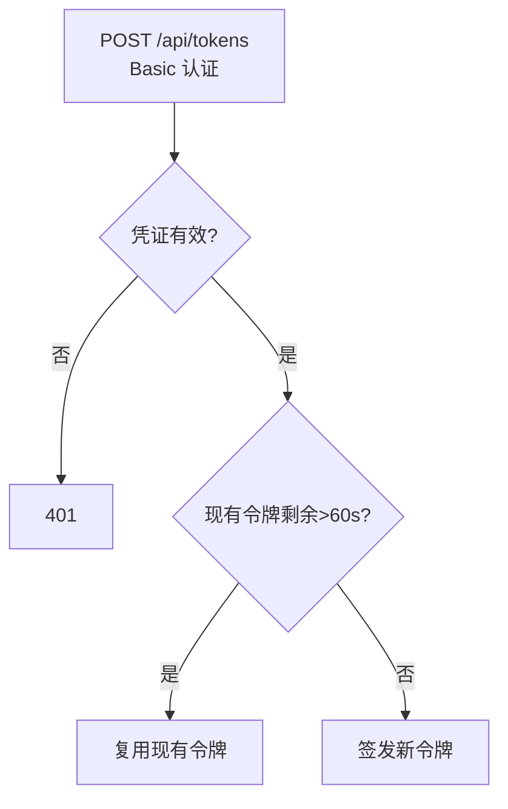
```mermaid
flowchart TD
  A[POST /api/tokens<br/>Basic 认证] --> B{凭证有效?}
  B -- 否 --> C[401]
  B -- 是 --> D{现有令牌剩余&gt;60s?}
  D -- 是 --> E[复用现有令牌]
  D -- 否 --> F[签发新令牌]
```

### 2.16 API：吊销令牌（F-0084）

客户端凭当前令牌请求注销，令牌立即失效（过期时间被设为过去）（`app/api/tokens.py:14-17`，`app/models.py:270-272`）。

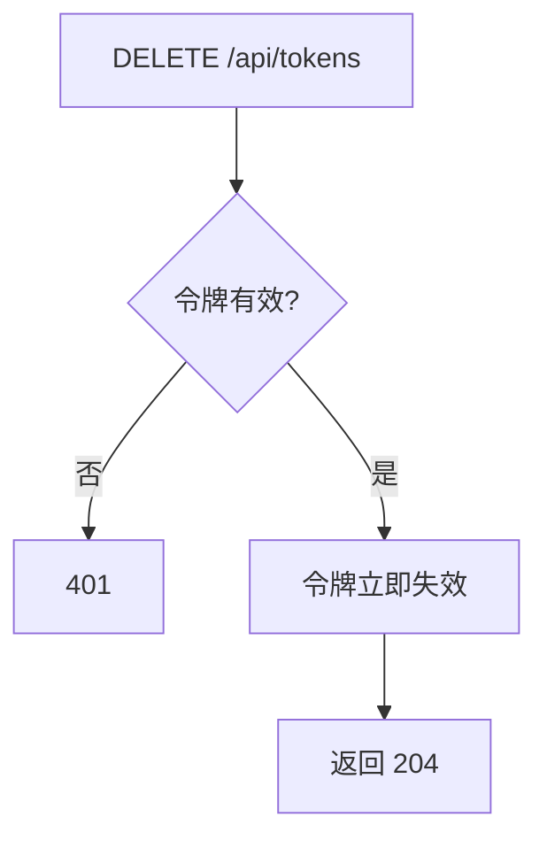
```mermaid
flowchart TD
  A[DELETE /api/tokens] --> B{令牌有效?}
  B -- 否 --> C[401]
  B -- 是 --> D[令牌立即失效] --> E[返回 204]
```

### 2.17 API：注册用户（F-0085）

客户端无需登录即可提交用户名、邮箱、密码注册新用户（三字段缺一不可），成功后返回 201 并在 Location 头给出新用户资源地址；用户名/邮箱被占用返回 400（`app/api/users.py:45-61`）。

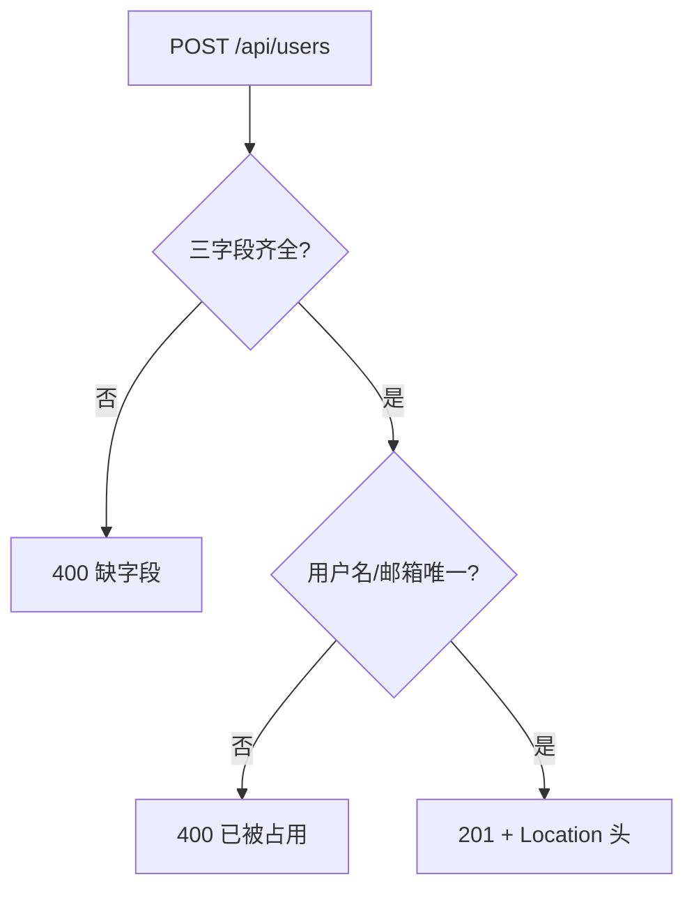
```mermaid
flowchart TD
  A[POST /api/users] --> B{三字段齐全?}
  B -- 否 --> C[400 缺字段]
  B -- 是 --> D{用户名/邮箱唯一?}
  D -- 否 --> E[400 已被占用]
  D -- 是 --> F[201 + Location 头]
```

### 2.18 API：修改资料（F-0086）

登录用户通过 API 修改自己的用户名、邮箱和简介；只能修改本人资料，否则 403；仅当新值与当前值不同才检查唯一性（`app/api/users.py:64-81`，`app/models.py:253-258`）。

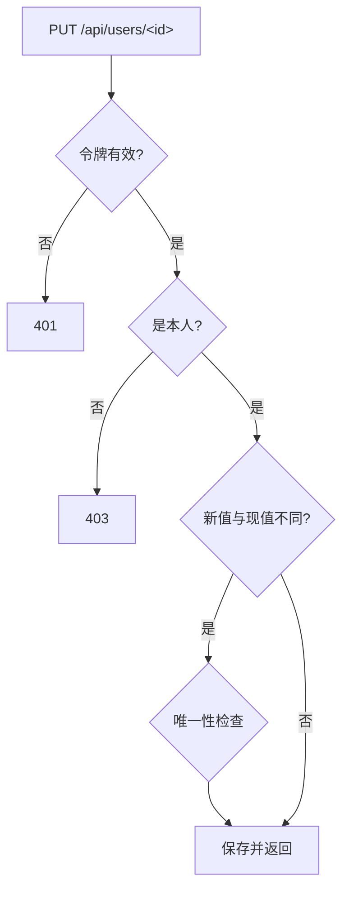
```mermaid
flowchart TD
  A[PUT /api/users/&lt;id&gt;] --> B{令牌有效?}
  B -- 否 --> C[401]
  B -- 是 --> D{是本人?}
  D -- 否 --> E[403]
  D -- 是 --> F{新值与现值不同?}
  F -- 是 --> G{唯一性检查} --> H[保存并返回]
  F -- 否 --> H
```

## 3. 实体与关系

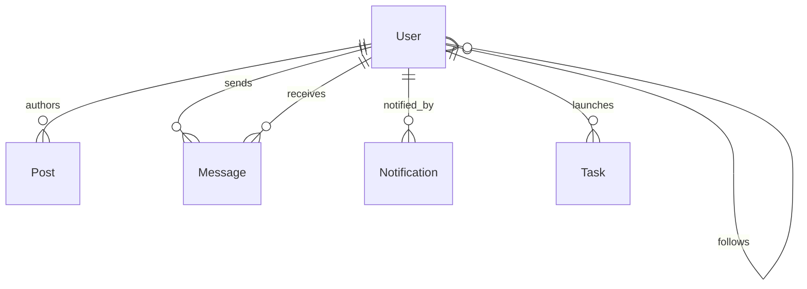
```mermaid
erDiagram
  User ||--o{ Post : "authors"
  User }o--o{ User : "follows"
  User ||--o{ Message : "sends"
  User ||--o{ Message : "receives"
  User ||--o{ Notification : "notified_by"
  User ||--o{ Task : "launches"
```

### User（F-0001）

User 代表一名注册用户，拥有用户名、邮箱、密码散列、个人简介、最后在线时间，以及 API 访问令牌。

| 字段 | 类型 | 约束 | 出处 |
|---|---|---|---|
| id | Integer | 主键 | `app/models.py:99` |
| username | String(64) | 唯一、有索引、必填 | `app/models.py:100-101` |
| email | String(120) | 唯一、有索引、必填 | `app/models.py:102-103` |
| password_hash | String(256) | 可空（仅存散列，不存明文） | `app/models.py:104` |
| about_me | String(140) | 可空、最长 140 字 | `app/models.py:105` |
| last_seen | DateTime | 可空，默认当前时间 | `app/models.py:106-107` |
| last_message_read_time | DateTime | 可空 | `app/models.py:108` |
| token | String(32) | 可空、唯一、有索引 | `app/models.py:109-110` |
| token_expiration | DateTime | 可空 | `app/models.py:111` |

### Post（F-0002）

Post 代表一条用户发布的博客动态，正文最长 140 字符，记录发布时间、作者和检测到的语言。

| 字段 | 类型 | 约束 | 出处 |
|---|---|---|---|
| id | Integer | 主键 | `app/models.py:289` |
| body | String(140) | 必填、最长 140 字、纳入全文索引 | `app/models.py:290`，`app/models.py:288` |
| timestamp | DateTime | 有索引，默认当前时间 | `app/models.py:291-292` |
| user_id | Integer | 外键 → User.id，有索引 | `app/models.py:293-294` |
| language | String(5) | 可空 | `app/models.py:295` |

### Message（F-0003）

Message 代表一条用户之间的私信，有发送者、接收者、正文（最长 140 字符）和发送时间。

| 字段 | 类型 | 约束 | 出处 |
|---|---|---|---|
| id | Integer | 主键 | `app/models.py:304` |
| sender_id | Integer | 外键 → User.id，有索引 | `app/models.py:305-306` |
| recipient_id | Integer | 外键 → User.id，有索引 | `app/models.py:307-309` |
| body | String(140) | 必填、最长 140 字 | `app/models.py:310` |
| timestamp | DateTime | 有索引，默认当前时间 | `app/models.py:311-312` |

### Notification（F-0004）

Notification 代表给某个用户的一条通知，按名字区分类型（同名通知会被覆盖），负载以 JSON 文本存储。

| 字段 | 类型 | 约束 | 出处 |
|---|---|---|---|
| id | Integer | 主键 | `app/models.py:325` |
| name | String(128) | 有索引 | `app/models.py:326` |
| user_id | Integer | 外键 → User.id，有索引 | `app/models.py:327-329` |
| timestamp | Float | 有索引，默认当前时间戳 | `app/models.py:330` |
| payload_json | Text | 必填，JSON 字符串 | `app/models.py:331` |

### Task（F-0005）

Task 代表一个由用户触发的后台异步任务（如导出博文），记录任务名、描述、所属用户和是否完成。

| 字段 | 类型 | 约束 | 出处 |
|---|---|---|---|
| id | String(36) | 主键（即 RQ 任务 id） | `app/models.py:339` |
| name | String(128) | 有索引 | `app/models.py:340` |
| description | String(128) | 可空 | `app/models.py:341` |
| user_id | Integer | 外键 → User.id | `app/models.py:342` |
| complete | Boolean | 默认 False | `app/models.py:343` |

## 4. 业务规则全书

### api

- [F-0087] 除用户注册外，所有 API 接口（查询用户、粉丝列表、关注列表、修改资料、吊销令牌）都必须携带有效访问令牌才能调用
  - 出处: `app/api/users.py:11-11`; `app/api/users.py:16-17`; `app/api/users.py:26-26`; `app/api/users.py:36-36`; `app/api/users.py:65-65`; `app/api/tokens.py:15-15` · enforcement: backend
- [F-0088] 任何持有有效令牌的登录用户都可以查看任意用户的资料、粉丝列表和关注列表，没有仅本人可见的限制
  - 出处: `app/api/users.py:10-13`; `app/api/users.py:25-32`; `app/api/users.py:35-42` · enforcement: backend
- [F-0089] 用户列表、粉丝列表和关注列表接口均支持分页，默认每页 10 条，每页最多 100 条，超出部分会被截断
  - 出处: `app/api/users.py:19-22`; `app/api/users.py:28-32`; `app/api/users.py:38-42` · enforcement: backend
- [F-0090] 用户只能修改自己的资料，尝试修改他人资料会被拒绝并返回 403
  - 出处: `app/api/users.py:66-67` · enforcement: backend
- [F-0091] 访问令牌有效期为 1 小时；如果现有令牌剩余有效期超过 60 秒，再次获取令牌时会直接复用现有令牌而不是生成新令牌
  - 出处: `app/models.py:260-268`; `app/api/tokens.py:8-11` · enforcement: backend
- [F-0092] API 返回的用户资料包含用户名、个人简介、发帖数、粉丝数、关注数和头像链接，但不包含邮箱地址（所有 API 调用均未启用邮箱返回）
  - 出处: `app/models.py:231-251`; `app/api/users.py:13-13`; `app/api/users.py:60-61`; `app/api/users.py:81-81` · enforcement: backend
- [F-0093] 通过 API 注册新用户时必须同时提供用户名、邮箱和密码三个字段，缺一不可
  - 出处: `app/api/users.py:47-49` · enforcement: backend
- [F-0094] 用户名和邮箱在全站范围内唯一，注册或修改资料时若已被他人占用会被拒绝
  - 出处: `app/api/users.py:50-56`; `app/api/users.py:72-79` · enforcement: backend
- [F-0095] 修改资料时仅当用户名或邮箱的新值与当前值不同才会检查唯一性，提交与当前相同的值不会报错
  - 出处: `app/api/users.py:72-79` · enforcement: backend
- [F-0096] 所有 API 错误响应统一为 JSON 格式，包含 error 字段（HTTP 状态描述）和可选的 message 字段（具体错误说明）
  - 出处: `app/api/errors.py:6-14`; `app/api/errors.py:17-18` · enforcement: backend
- [F-0097] 使用已被占用的用户名或邮箱注册时返回 400 错误并提示更换用户名或邮箱
  - 出处: `app/api/users.py:50-56`; `app/api/errors.py:13-14` · enforcement: backend
- [F-0098] 请求不存在的用户（查询、查粉丝、查关注或修改）时返回 404 错误
  - 出处: `app/api/users.py:13-13`; `app/api/users.py:27-27`; `app/api/users.py:37-37`; `app/api/users.py:68-68` · enforcement: backend
- [F-0099] 携带无效、缺失或已过期的访问令牌调用受保护接口时认证失败并返回 401 错误
  - 出处: `app/api/auth.py:24-30`; `app/models.py:274-280`; `app/api/errors.py:6-10` · enforcement: backend
- [F-0100] 换取令牌时提供的用户名不存在或密码错误会导致 Basic 认证失败并返回 401 错误
  - 出处: `app/api/auth.py:12-21` · enforcement: backend

### auth

- [F-0016] 已登录用户再访问登录、注册、找回密码、重置密码页面时会被直接重定向到首页，不能重复操作
  - 出处: `app/auth/routes.py:16-17`; `app/auth/routes.py:41-42`; `app/auth/routes.py:57-58`; `app/auth/routes.py:74-75` · enforcement: backend
- [F-0017] 登录成功后只允许跳转到本站内的地址，带有外部域名的跳转目标会被忽略并改跳首页（防止开放重定向）
  - 出处: `app/auth/routes.py:27-30` · enforcement: backend
- [F-0018] 注册时用户名、邮箱、密码均为必填，邮箱必须符合邮箱格式，且两次输入的密码必须一致
  - 出处: `app/auth/forms.py:17-24` · enforcement: frontend
- [F-0019] 注册时用户名和邮箱都必须在全站唯一，已被占用的用户名或邮箱会被拒绝并提示更换
  - 出处: `app/auth/forms.py:26-35` · enforcement: frontend
- [F-0020] 登录时用户名和密码均为必填项
  - 出处: `app/auth/forms.py:10-13` · enforcement: frontend
- [F-0021] 登录失败时无论用户名不存在还是密码错误，都只显示统一的「用户名或密码无效」提示并回到登录页，不区分具体原因
  - 出处: `app/auth/routes.py:20-25` · enforcement: backend
- [F-0022] 提交找回密码邮箱后，无论该邮箱是否注册了账号，页面都显示相同的「请查收邮件」提示，避免被用来探测已注册邮箱
  - 出处: `app/auth/routes.py:59-66` · enforcement: backend
- [F-0023] 重置密码链接无效或已过期时，用户被静默重定向到首页，没有任何错误提示
  - 出处: `app/auth/routes.py:76-78`; `app/models.py:185-190` · enforcement: backend
- [F-0024] 重置密码链接的有效期为 10 分钟，超时后链接失效
  - 出处: `app/models.py:180-183` · enforcement: backend
- [F-0025] 重置密码邮件以管理员邮箱为发件人、在后台线程异步发送，不阻塞用户请求
  - 出处: `app/auth/email.py:6-14`; `app/email.py:20-24` · enforcement: backend
- [F-0026] 注册成功后无需验证邮箱即可直接登录，邮箱真实性不做任何确认
  - 出处: `app/auth/routes.py:44-50` · enforcement: backend
- [F-0027] **[DISCREPANCY]** 重置密码页面的标题是「重置你的密码」，但表单提交按钮的文案却是「请求密码重置」，与实际动作（设置新密码）不一致
  - 出处: `app/templates/auth/reset_password.html:4`; `app/auth/forms.py:45-48` · enforcement: frontend
- [F-0028] 遇到 404 或 500 错误时，系统根据请求方的接受类型返回网页或 JSON；发生 500 时会先回滚数据库会话，且错误页提示「管理员已收到通知」
  - 出处: `app/errors/handlers.py:7-24`; `app/templates/errors/404.html:1-6`; `app/templates/errors/500.html:1-7` · enforcement: backend
- [F-0101] 全站表单通过统一的宏渲染，字段校验失败时会在对应输入框下方以红色内联提示具体错误信息
  - 出处: `app/templates/bootstrap_wtf.html:26-28`; `app/templates/bootstrap_wtf.html:40-42`; `app/templates/bootstrap_wtf.html:54-60` · enforcement: frontend

### messaging

- [F-0071] 私信内容必填，长度必须在 1 到 140 个字符之间，表单校验与数据库字段长度限制一致
  - 出处: `app/main/forms.py:50-53`; `app/models.py:309` · enforcement: multiple
- [F-0072] 私信发送成功后，系统会重新计算收件人的未读私信数量并写入其通知，供收件人页面的未读提示更新
  - 出处: `app/main/routes.py:186-191`; `app/models.py:195-200` · enforcement: backend
- [F-0073] 用户一旦打开私信列表页，系统就把当前时间记为其私信最后阅读时间，并把未读私信数通知清零，即无需逐条操作即全部视为已读
  - 出处: `app/main/routes.py:201-203` · enforcement: backend
- [F-0074] 同一用户同一类型的通知只保留最新一条：写入新通知前会先删除该用户的同名旧通知
  - 出处: `app/models.py:202-207` · enforcement: backend
- [F-0075] 未读私信数按“发送时间晚于用户最后阅读时间”的私信条数计算；从未读过私信的用户以 1900 年 1 月 1 日为基准时间
  - 出处: `app/models.py:195-200` · enforcement: backend
- [F-0076] 向不存在的用户名发私信时，系统返回 404 页面而不是创建私信
  - 出处: `app/main/routes.py:184` · enforcement: backend
- [F-0077] 未登录用户无法访问发私信、私信列表和通知查询入口，会被要求先登录
  - 出处: `app/main/routes.py:182`; `app/main/routes.py:199`; `app/main/routes.py:230` · enforcement: backend
- [F-0078] 通知查询接口以 JSON 返回当前用户在指定时间戳之后产生的通知（按时间升序），供页面定时轮询增量更新；不带参数首次请求时返回全部历史通知
  - 出处: `app/main/routes.py:229-240` · enforcement: backend
- [F-0079] 系统未校验收件人与发件人是否为同一人，用户可以给自己发送私信
  - 出处: `app/main/routes.py:183-193` · enforcement: backend
- [F-0080] **[DISCREPANCY]** 后端为私信列表计算并传入了上一页/下一页的翻页链接，但模板中“更新的私信/更早的私信”按钮的链接固定为空锚点（#），用户实际无法点击翻页
  - 出处: `app/main/routes.py:210-215`; `app/templates/messages.html:10-19` · enforcement: frontend
- [F-0081] 私信列表复用博客动态的展示组件渲染每条私信，因此私信以发送者的头像、用户名和发送时间呈现，点击头像进入发送者主页
  - 出处: `app/templates/messages.html:5-6` · enforcement: frontend
- [F-0082] 私信列表的每页条数不单独配置，直接沿用全站动态列表的 POSTS_PER_PAGE 配置
  - 出处: `app/main/routes.py:207-209` · enforcement: backend

### posts

- [F-0030] 博文内容必填，长度必须在 1 到 140 个字符之间
  - 出处: `app/main/forms.py:31-34`; `app/models.py:290-290` · enforcement: multiple
- [F-0031] 发布博文时系统自动检测正文语言并随博文保存；语言检测失败（如内容过短）时语言字段留空
  - 出处: `app/main/routes.py:29-35` · enforcement: backend
- [F-0032] 首页信息流只展示当前用户关注的人（含自己）的博文，探索页则展示全站所有用户的博文并按时间倒序排列
  - 出处: `app/main/routes.py:41-51`; `app/main/routes.py:54-68` · enforcement: backend
- [F-0033] 首页、探索页、消息页等列表均按每页 25 条分页，页码通过 URL 参数 page 传递
  - 出处: `app/main/routes.py:41-44`; `config.py:25-25` · enforcement: backend
- [F-0034] 分页页码超出范围时不会报错，而是显示空列表（error_out=False）
  - 出处: `app/main/routes.py:42-44`; `app/main/routes.py:58-60` · enforcement: backend
- [F-0036] 搜索关键词必填；搜索表单读取 URL 查询参数且不启用 CSRF 校验
  - 出处: `app/main/forms.py:37-44` · enforcement: frontend
- [F-0037] 提交空的搜索关键词时不执行搜索，直接重定向到探索页
  - 出处: `app/main/routes.py:167-168` · enforcement: backend
- [F-0038] Elasticsearch 未配置时，搜索静默返回空结果（0 条），博文的索引写入与删除也被静默跳过
  - 出处: `app/search.py:4-5`; `app/search.py:14-15`; `app/search.py:19-20`; `config.py:23-23` · enforcement: backend
- [F-0039] 博文在数据库中新增、修改或删除后，系统在同一事务提交后自动把正文同步到 Elasticsearch 索引，搜索结果按索引相关度排序
  - 出处: `app/models.py:34-51`; `app/models.py:59-60`; `app/models.py:287-288`; `app/search.py:17-26` · enforcement: backend
- [F-0040] 搜索结果分页时，仅当匹配总数超过「当前页码 × 每页条数」才显示下一页链接，页码大于 1 才显示上一页链接
  - 出处: `app/main/routes.py:172-175` · enforcement: backend
- [F-0042] 仅当博文带语言标记且与当前用户界面语言不同时，才显示「翻译」链接
  - 出处: `app/templates/_post.html:18-18` · enforcement: frontend
- [F-0043] 翻译服务未配置密钥时，翻译请求返回「Error: the translation service is not configured.」的提示文本而不是报错
  - 出处: `app/translate.py:6-8`; `config.py:22-22` · enforcement: backend
- [F-0044] 微软翻译 API 返回非 200 状态码时，用户看到的是「Error: the translation service failed.」提示文本，接口本身仍返回成功
  - 出处: `app/translate.py:14-19` · enforcement: backend
- [F-0045] 翻译接口直接读取请求 JSON 中的 text、source_language、dest_language 字段且不做校验，字段缺失会导致服务器内部错误
  - 出处: `app/main/routes.py:159-162` · enforcement: backend
- [F-0047] 用户已有导出任务进行中时再次点击导出，只提示「An export task is currently in progress」，不会重复启动任务
  - 出处: `app/main/routes.py:221-223` · enforcement: backend
- [F-0048] 导出任务执行中发生异常时，错误只记录到服务端日志，任务仍被标记为 100% 完成，用户收不到失败通知
  - 出处: `app/tasks.py:49-53` · enforcement: backend
- [F-0049] 导出的博文归档仅包含正文和时间戳两个字段，按发布时间升序排列，并以 JSON 文件附件随邮件发出
  - 出处: `app/tasks.py:33-39`; `app/tasks.py:41-47` · enforcement: backend
- [F-0050] 首页、探索页、翻译、搜索、导出等所有博文相关操作都要求用户已登录，未登录访问会被重定向到登录页
  - 出处: `app/main/routes.py:27-27`; `app/main/routes.py:55-55`; `app/main/routes.py:157-157`; `app/main/routes.py:166-166`; `app/main/routes.py:220-220` · enforcement: backend

### social

- [F-0055] 用户不能关注自己，后端检测到自关注时提示"你不能关注自己！"并跳回自己的主页
  - 出处: `app/main/routes.py:123-125` · enforcement: backend
- [F-0056] 用户不能对自己执行取消关注操作，后端检测到时提示"你不能取消关注自己！"并跳回自己的主页
  - 出处: `app/main/routes.py:143-145` · enforcement: backend
- [F-0057] 重复关注同一用户不会产生重复的关注关系，只有尚未关注时才会添加；取消关注仅在已关注时生效
  - 出处: `app/models.py:142-149` · enforcement: backend
- [F-0058] 查看他人主页时，关注/取关按钮的显示取决于当前是否已关注该用户；查看自己的主页时显示"编辑个人资料"链接而不显示关注按钮
  - 出处: `app/templates/user.html:14-33` · enforcement: frontend
- [F-0059] 已登录用户的每次请求都会自动刷新其"最近上线时间"，该时间在个人主页和资料浮层中向他人展示
  - 出处: `app/main/routes.py:16-22`; `app/templates/user.html:9-11`; `app/templates/user_popup.html:6-8` · enforcement: backend
- [F-0060] 用户头像由 Gravatar 根据邮箱地址的 MD5 哈希生成，系统不提供上传自定义头像的功能
  - 出处: `app/models.py:138-140` · enforcement: backend
- [F-0061] 编辑资料时用户名必填，且若修改为新用户名，该用户名不得已被其他用户占用，否则提示"请使用其他用户名"
  - 出处: `app/main/forms.py:12-13`; `app/main/forms.py:17-27`; `app/models.py:100-101` · enforcement: multiple
- [F-0062] 个人简介（关于我）最长 140 个字符，表单与数据库字段均限制为 140
  - 出处: `app/main/forms.py:14-15`; `app/models.py:105` · enforcement: multiple
- [F-0063] 查看用户主页、资料浮层、编辑资料、关注与取关操作均要求用户已登录，未登录访问会被重定向到登录页并提示"请登录后访问此页面"
  - 出处: `app/main/routes.py:71-72`; `app/main/routes.py:89-90`; `app/main/routes.py:97-98`; `app/main/routes.py:114-115`; `app/main/routes.py:135-136`; `app/__init__.py:22-24` · enforcement: backend
- [F-0064] 关注或取关的目标用户名不存在时，后端提示"未找到该用户"并将用户重定向回首页，不产生任何关系变更
  - 出处: `app/main/routes.py:118-121`; `app/main/routes.py:139-142` · enforcement: backend
- [F-0065] 访问不存在用户的个人主页或资料浮层时，系统返回 404 页面
  - 出处: `app/main/routes.py:73`; `app/main/routes.py:91` · enforcement: backend
- [F-0066] 关注/取关接口只接受 POST 提交，直接以 GET 等方式访问会因表单校验失败而被静默重定向回首页，无任何提示
  - 出处: `app/main/routes.py:114-132`; `app/main/routes.py:135-153`; `app/main/forms.py:30-31` · enforcement: backend
- [F-0067] **[DISCREPANCY]** 编辑资料表单对新用户名仅校验必填、无长度上限，而数据库用户名字段最长 64 字符，超长用户名可通过表单校验后在数据库层被截断或报错
  - 出处: `app/main/forms.py:12-13`; `app/models.py:100-101` · enforcement: multiple
- [F-0068] 个人主页与发现页分页请求超出范围页码时不报错，而是返回空列表（分页不抛 404）
  - 出处: `app/main/routes.py:75-78` · enforcement: backend

## 5. 边界与异常

完整的 edge_case 与 discrepancy 清单见第 4 节（机械生成部分已包含）。以下是最值得警惕的几条：

- **数据截断风险（F-0067，discrepancy）**：编辑资料表单对新用户名没有长度上限，而数据库 username 最长 64 字符——超长输入能通过表单校验，到数据库层被截断或直接报错，存在写入不一致的风险。
- **功能失效（F-0080，discrepancy）**：私信列表的分页按钮链接在模板中被写死为 `#`，后端算好的翻页链接根本没被使用，用户实际上无法翻看更早的私信。
- **静默失败（F-0038 / F-0043 / F-0044 / F-0048）**：Elasticsearch 未配置时搜索静默返回空结果；翻译服务未配置或失败时返回提示文本而非错误；导出任务异常时仍被标记为 100% 完成、用户收不到任何失败通知。这些"看起来正常"的失败对运维和排障极不友好。
- **安全相关**：登录失败与找回密码均采用统一提示，避免枚举账号（F-0021 / F-0022，good）；但注册后不做邮箱验证即可登录（F-0026）；重置密码链接失效后是**静默**重定向、无任何提示（F-0023）；API 任意登录用户可查看任意用户资料（F-0088）。
- **弱校验入口（F-0045）**：翻译接口直接读取请求 JSON 的字段且不做校验，字段缺失会导致 500。

## 6. 附录

### 置信度说明

| 级别 | 含义 | 本文档数量 |
|---|---|---|
| high | 代码中显式存在 | 96 |
| medium | 由多处线索推断 | 5 |
| low | 证据薄弱/有歧义（正文会标 ⚠️） | 0 |

### 覆盖报告

- **路由覆盖**：Phase 0 路由表全部 28 个条目（13 个 main + 5 个 auth + 2 个错误处理 + 8 个 API）均被至少一条事实引用。
- **页面覆盖**：Phase 0 页面清单全部 18 个模板均被至少一条事实引用。
- **盲区清单：零。** 所有路由与页面均有出处引用。
- **跳过阶段**：无。项目具备完整的数据库模型（`app/models.py` + 9 个 Alembic 迁移），Phase 1 正常执行。
- **子代理情况**：fan-out 路径，5 个域（auth / posts / social / messaging / api）各 1 个子代理，全部一次成功返回，无需重派、无失败域。4 个域的返回中存在少量行号越界（共 7 处，均为 1–4 行的末端越界），由主编排代理在实读文件后修正，修正后的数组均通过 validate_facts.py。
- **其他说明**：`tests.py`、`deployment/`、`migrations/env.py`、`app/cli.py` 等非业务文件未纳入路由/页面清单；`app/cli.py`（翻译 CLI 命令）与 `microblog.py`（入口）属于运维脚手架，不构成用户可见业务事实。

