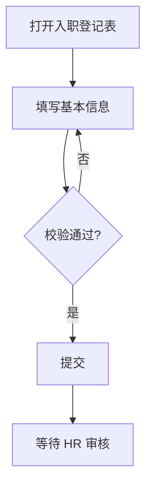
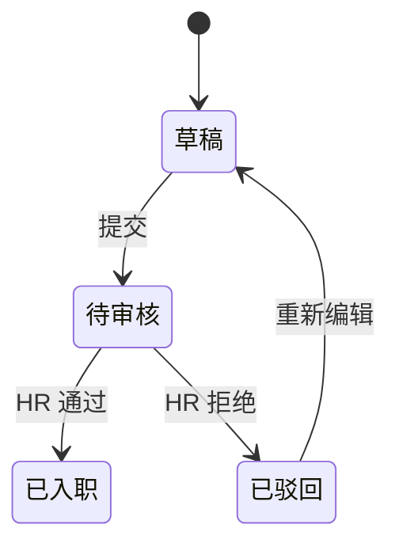

# Handbook Authoring Guide (BUSINESS_FACTS.md)

The handbook is written for **humans first** (new hires, PMs, QA) but every
claim must trace back to `facts.json`. Mechanical sections are generated by
`scripts/render_md.py` — never hand-write ER diagrams or rule lists.

## Section order

1. **项目概述** — one paragraph: what the system is, who it serves, the single
   most important user task. Prose, no citations needed here.
2. **角色与用户任务** — actor × task matrix (table), then one subsection per
   user task: numbered steps + Mermaid flowchart + inline sources
   (`file:lines`) on each step group. Steps come from `user_flow` facts;
   write the narrative yourself, keyed to the fact id.
3. **实体与关系** — embed `render_md.py --section er` output, then per entity:
   what it represents (from the `entity` fact statement) + field table
   (field / type / constraints / source). Field tables are prose work: read
   the model code, cite lines.
4. **业务规则全书** — embed `render_md.py --section rules` output verbatim.
5. **边界与异常** — same rules output covers edge_case/discrepancy; here add a
   short narrative calling out the most dangerous ones (data loss, money,
   security) if any.
6. **附录** — confidence legend + coverage report.

## Coverage report (appendix, mandatory)

- List every route-table entry and page from Phase 0 that is **not** referenced
  by any fact's sources → "盲区清单" (blind spots). Honesty over completeness.
- Note skipped phases (e.g. "无数据库，Phase 1 跳过").
- Note subagent domains that failed after 2 retries, if any.

## Writing rules

- One fact = one claim. No compound sentences hiding two rules in one bullet.
- Business language, not code: say "提交后不可再修改", not "`isSubmitted` flag prevents edits".
- Every rule/edge-case/constraint line must carry `file:lines` — if you can't
  find the source, the fact doesn't exist. Delete it or mark `confidence: low`
  with an explicit "推测" note.
- Discrepancies are features, not bugs: present both sides, never pick a winner.

## Mermaid templates

User flow:

State machine (use for lifecycle fields like 审批状态):

